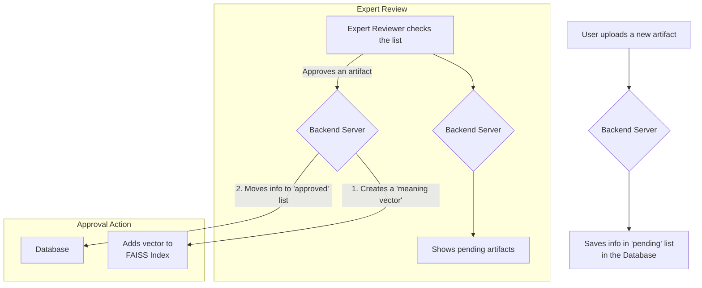
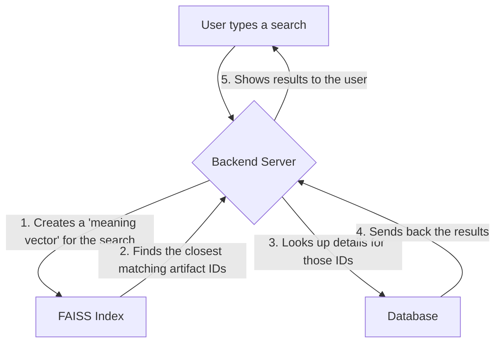

# ArchSearch: A Smart Library for Archaeologists 🏺

Welcome to ArchSearch! This project is like a special, smart library for archaeologists and historians. They can upload information about the cool things they find, like ancient pottery, fossils, or old tools. An expert reviewer checks every new discovery to make sure the information is accurate before adding it to the main library.

## What's Inside? (The Project Components)

This project has a few main parts that work together, just like a team.

### 1. The Frontend: The Part You See and Use
- **What it is:** This is the website you interact with. It's where you can log in, search for artifacts, and upload new discoveries.
- **How it's built:** It's a single `archSearch.html` file that uses HTML for the structure, CSS for the style, and JavaScript to make it interactive.

### 2. The Backend: The Brain of the Operation
- **What it is:** This is the server that runs in the background. It does all the heavy lifting, like managing users, saving artifact information, and handling search requests.
- **How it's built:** It's a Python program using a tool called **Flask**.

### 3. The SQLite Database: The Filing Cabinet
- **What it is:** This is where we store all the text information about the artifacts. Think of it as a digital filing cabinet. The file is named `archsearch.db`.
- **How it's used:**
    - When someone uploads a new artifact, its details (name, description, location) are saved in a "pending" table inside the database.
    - An expert reviewer looks at these pending items.
    - When the expert **approves** an artifact, its information is moved to the "approved" table.
    - The search results pull their final information from this "approved" table.

### 4. The Vector Index: The Super-Smart Librarian
- **What it is:** This is the secret sauce that makes our search so smart! It's a special file called `artifact_vectors.index` that helps the computer understand the *meaning* of words, not just the words themselves.
- **How it's used:** When you search for something, the backend uses this "librarian" to find the most relevant artifacts, even if you don't use the exact right words.

---

## The Magic of Smart Search ✨ (How Vector Indexing Works)

How does a computer understand "Find me things like ancient Roman coins"? Computers only really understand numbers. This is where vectors come in!

#### Step 1: Turning Words into Numbers (Vectors)
When an artifact is approved, we use a special AI model to "read" its description. The model then translates that description into a list of 384 numbers. This list of numbers is called a **vector**.

This vector is like a unique fingerprint for the *meaning* of the text.

#### An Easy Analogy: Thinking with Colors
Imagine you had to describe every color using only 3 numbers for **R**ed, **G**reen, and **B**lue.

- A bright red would be `[255, 0, 0]`.
- A bright green would be `[0, 255, 0]`.
- A dark purple would be `[75, 0, 130]`.

Colors that are visually similar (like two different shades of blue) would have very similar sets of numbers.

Our project does the exact same thing, but for **meaning**. Instead of 3 numbers for color, we use **384 numbers** to capture the ideas in a description.

- The text "Ancient Mayan calendar stone" gets turned into a list of 384 numbers.
- The text "Aztec sun stone" gets turned into a *different*, but mathematically *very similar*, list of 384 numbers, because their meanings are closely related.
- The text "Egyptian papyrus scroll" would have a list of numbers that is mathematically "far away" from the other two.

#### Step 2: Finding the Closest Neighbors
The **Vector Index (`artifact_vectors.index`)** is a special map of all these number lists. When you search for "old Mesoamerican carving," the system first turns your search into its own vector (its own list of 384 numbers).

Then, it asks the Vector Index: "Which of the artifact vectors in our library are mathematically closest to this search vector?"

The index instantly points to the closest matches, which are the most relevant artifacts. This is how we can find things based on meaning and context, which is much smarter than just matching keywords!

---

## Project Workflow (Visualized)

Here’s how information moves through the ArchSearch system.

### Upload & Approval Workflow



### Search Workflow



---

## How to Run This Project

1.  **Make sure you have Python installed.**
2.  **Open a terminal and navigate to this project's folder.**
3.  **Install the necessary tools:**
    ```bash
    pip install -r backend/requirements.txt
    ```
4.  **Start the backend server:**
    ```bash
    .venv/bin/python backend/app.py
    ```
5.  **Open the `archSearch.html` file in your web browser** to use the application!

---

## Inspecting the Data

If you want to see the raw data stored in the database or the vector index, you can use these commands from your terminal.

### Viewing the SQLite Database (`archsearch.db`)

This lets you see the tables of approved and pending artifacts.

1.  Open the database file using the `sqlite3` command-line tool:
    ```bash
    sqlite3 backend/archsearch.db
    ```
2.  Once you're inside the SQLite prompt (`sqlite>`), you can run SQL queries. For example:
    ```sql
    -- See all approved artifacts
    SELECT * FROM approved;

    -- See all pending artifacts
    SELECT * FROM pending;
    ```
3.  To exit the SQLite prompt, type `.quit`.

### Viewing the FAISS Vector Index (`artifact_vectors.index`)

This runs a script that tells you how many vectors are in the index and what their dimension is.

```bash
.venv/bin/python backend/inspect_index.py
```
